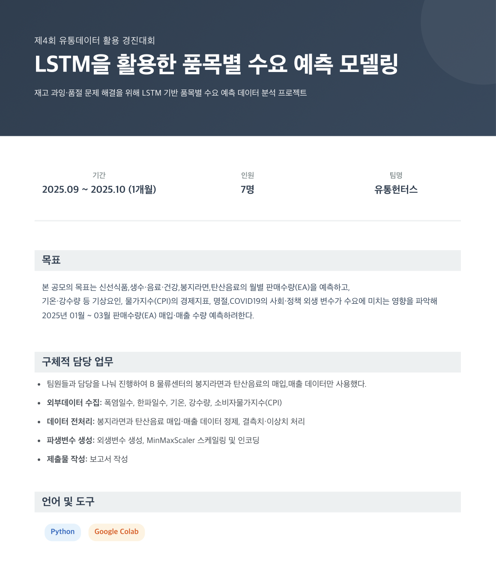

  

### 회고

- 일별 데이터를 월별로 집계하고, 품목별로 데이터 구조를 만들어 결측치 및 이상치를 처리하고,
  외생 변수 결합을 직접 해보면서 모델링을 하기위해 깨끗하게 정리된 데이터 구조가 정말 중요하단 것을 알았다.
  CPI와 기상 데이터는 단순 병합이 아닌, 시계열 기준을 맞춰야 한다는 점에서 많은 시행착오를 겪었다.
  
- 공모전 기간에는 역할을 분담해 데이터 전처리까지만 진행했지만, 이후 혼자 상관분석, t-test, 의사결정나무, 그리고 LSTM 모델링까지 수행하여 2025년 1~3월 수요 예측을 직접 진행했다.

- 변수 선택을 하면서 연속형 변수와 이진형 변수의 특성에 맞는 방법을 적용해야 한다는 점것을 알게되었고,
  왜 이 모델을 사용하는가? 에 대해 고민하며 그 과정에서 각각의 모델 구조를 자세히 이해 할 수 있었다.

## 프로젝트 문서

 보고서 

- [보고서 - LSTM 모델을 활용한 품목별 수요예측.pdf](report/LSTM%모델을%활용한%품목별%수요예측.pdf)

